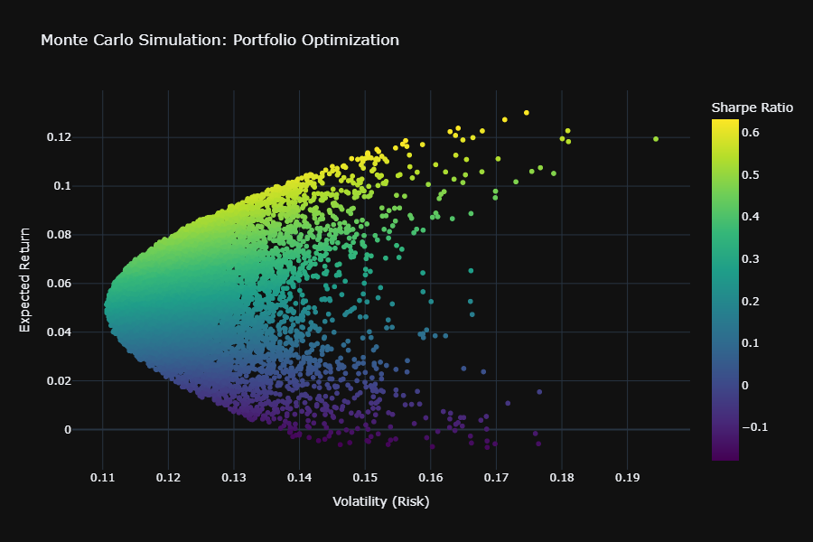

# MPT Portfolio Optimizer

Picks the long-only stock portfolio with the best risk-adjusted return for a small basket of US stocks, using mean-variance optimization. It also runs a Monte Carlo simulation of random portfolios next to the optimizer, which draws the efficient frontier and doubles as a sanity check. If the best random portfolio and the optimizer's answer end up far apart, one of them is wrong.

Mean-variance optimization describes a portfolio with two numbers, its expected return $w^\top \mu$ and its variance $w^\top \Sigma w$. Here $w$ is the weights, $\mu$ is each asset's expected annual return, and $\Sigma$ is the covariance matrix of daily returns. The code annualizes $\Sigma$ by multiplying it by 252 trading days.

The code estimates $\mu$ in one of two ways. By default it uses CAPM. For each asset it estimates a beta against the S&P 500 from daily returns, then computes

$$E[R_i] = R_f + \beta_i (R_m - R_f).$$

A stock that swings harder than the market gets a higher expected return. If you'd want to skip the model, `DataSet(CAPM=False)` uses the annualized mean of past log returns instead.

The optimizer maximizes the Sharpe ratio,

$$\text{Sharpe} = \frac{w^\top \mu - R_f}{\sqrt{w^\top \Sigma w}}$$

SciPy's SLSQP routine does the maximizing under two constraints. The weights add up to 1 and each one stays between 0 and 1. So you stay fully invested, with no shorting and no borrowing.

The Monte Carlo step generates 10,000 random weight vectors and plots return against volatility for each one, using color to show the Sharpe ratio. The top edge of that cloud is the efficient frontier, and the best random portfolio should land close to the SLSQP optimum.

## Results



Each dot is a random portfolio and its color shows the Sharpe ratio. The optimizer's pick sits at the tip of the highest-Sharpe part of the cloud, so the random search and the optimizer point to the same portfolio.

## Running it

```
pip install -r requirements.txt
python main.py
```

This pulls a year of daily prices from Yahoo Finance for the tickers in `get_tickers()` (AAPL, JNJ, XOM, JPM, NEE), saves the plot to `images/efficient_frontier.png`, and prints the max-Sharpe weights.

## Caveats

Mean-variance optimization reacts strongly to the return estimates. A small change in $\mu$ can move the optimal weights a lot, and the optimizer tends to concentrate the portfolio in whatever assets looked best in the sample. Past returns are a weak guide to future ones, which is the main reason CAPM is the default, though CAPM carries its own assumptions and still relies on a historical market premium.

A few other notes: The covariance matrix is the raw sample estimate with no shrinkage or regularization. That works for five stocks and about 250 days of data, but it would break down on a larger universe. The code hardcodes the risk-free rate at 2% instead of pulling current T-bill yields. The model covers a single period, so it ignores transaction costs, taxes, and turnover. It implements the textbook version directly, so the textbook's usual weaknesses apply here too.
